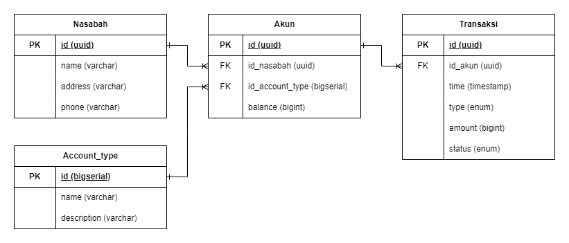
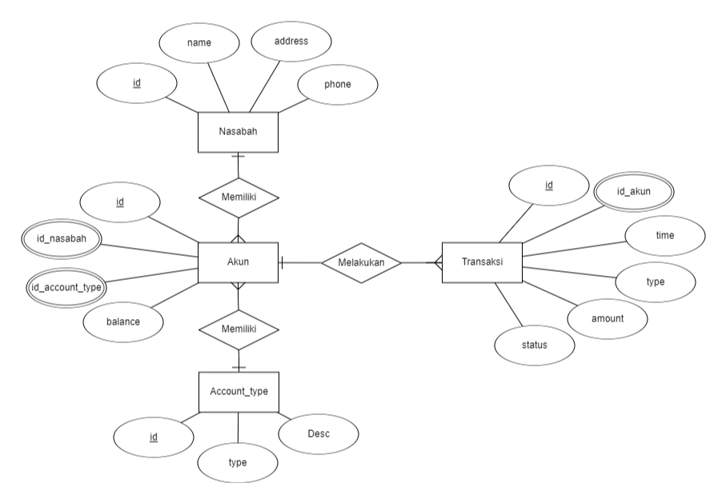

# Simple Banking Database Design
Welcome to the documentation for the banking system database design. This document aims to provide a comprehensive overview of the structure and relationships within the database, designed to support various banking functions, including customer management, account types, account information, and transaction history.

## Database Structure
### 1. Table Nasabah
This table stores basic information about each bank customer.
#### Columns:
- `id` (PK) : Unique ID for each customer.
- `name` : Full name of the customer.
- `address` : Customer's address.
- `phone` : Customer's phone number.

### 2. Table Account_Type
This table stores information about the different types of accounts available at the bank.
#### Columns :
- `id` (PK) : Unique ID for each account type.
- `name` : Name of the account type (e.g., Tabungan Mapan, Tabungan Edukasi).
- `description` : Short description of the account type.

### 3. Akun
This table stores information about the accounts held by customers.
#### Columns :
- `id` (PK) : Unique ID for each account.
- 'id_nasabah` (FK) : ID of the customer who owns the account.
- `id_account_type` (FK) : ID of the account type.
- `balance` : Current balance in the account.

### 4. Table Transaksi
This table stores the history of all transactions that occur in each account.
#### Columns:
- `id` : Unique ID for each transaction.
- `id_akun` : ID of the account associated with the transaction.
- `time` : Time of the transaction.
- `type` : Type of transaction (deposit/withdraw).
- `amount` : Amount of money transacted.
- `status` : Status of the transaction (succes/pending/fail).

## Table Relationships
1. Customers to Accounts: One customer can have multiple accounts (One-to-Many).
2. Account Types to Accounts: One account type can be associated with multiple accounts (One-to-Many).
3. Accounts to Transactions: One account can have multiple transactions (One-to-Many).

# Entity Relationship Diagram

